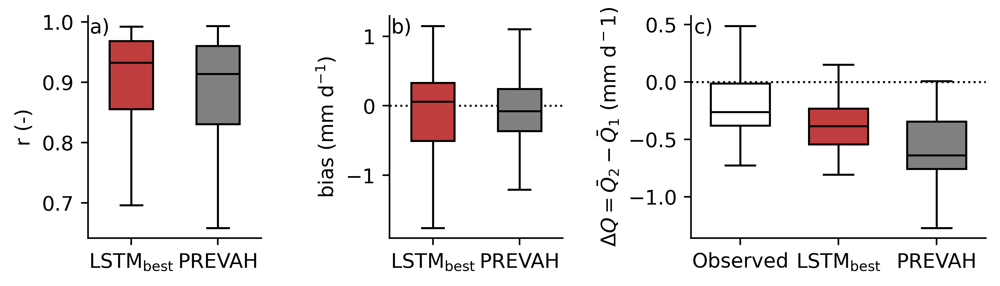
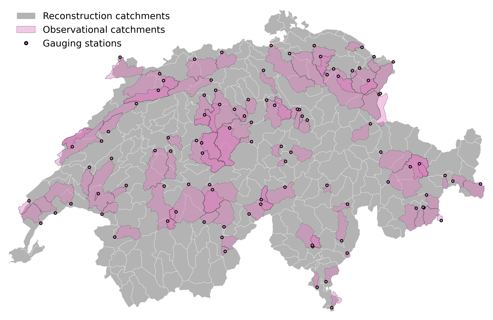

<div align="center">    
 
# CH-RUN: A data-driven spatially contiguous</br>runoff monitoring product for Switzerland

<!--Change batch name and link to paper -->
[](https://egusphere.copernicus.org/preprints/2024/egusphere-2024-993/)
[](https://www.datascience.ch/projects/mach-flow)

<figure>
  
  <figcaption></br>Fig. 8 from Kraft et al. (2025): Spatially contiguous reconstruction of runoff from 1962 to 2023. The maps represent the yearly catchment-level ruoff quantiles relative to the reference period (1971 to 2000) empirical distribution. The bottom bars show the decadal deviation in mm y−1 of the national-level runoff relative to the reference period.</figcaption>
</figure>

</div>

## Description

<!--Change batch name and link to paper -->
This repository contains the code for performing deep learning based reconstruction of runoff for Switzerland (Fig. 1).
More details can be found in [this publication](https://egusphere.copernicus.org/preprints/2024/egusphere-2024-993/).

<div align="center">
<figure>
  
  <figcaption></br>Fig. 1 from Kraft et al. (2025): From sparse observations with low human impact to contiguous coverage. The 98 observational catchments highlighted in magenta were selected by domain experts and served as a base for training and evaluating the data-driven models. Those catchments are only marginally affected by anthropogenic factors and are of similar size as the target catchments for reconstruction (grey).</figcaption>
</figure>
</div>

## Reconstruction results

The reconstruction data can be downloaded [here](https://doi.org/20.500.11850/714281).

## How to run

> [!IMPORTANT]  
> This code is shared for transparency and is not supposed to run out-of-the-box as the training data cannot be shared currently.

First, make sure that you have conda installed. Then, install dependencies:

```bash
# Clone the project.
git clone https://github.com/bask0/mach-flow.git

# Install the project.
# You may need to change this line `source $CONDA_PREFIX/etc/profile.d/mamba.sh` in `create_env.sh`).
cd mach-flow
bash create_env.sh
```

Next, run the model tuning and cross validation. GPU should automatically be detected if available. This takes a while.

```bash
# Run LSTM tuning and cross validation.
bash basin_level/run_experiment.sh -m LSTM

# Run TCN tuning and cross validation.
bash basin_level/run_experiment.sh -m TCN
```

Create figures:

```bash
# Create figures.  
bash create_plots.sh
```

### Citation

```
@article{kraft_chrun_2025,
  title={CH-RUN: A deep-learning-based spatially contiguous runoff reconstruction for Switzerland},
  author={B. Kraft, W. Aeberhard, M. Schirmer, M. Zappa, S. I. Seneviratne and L. Gudmundsson},
  journal={HESS},
  year={2025}
}
```
